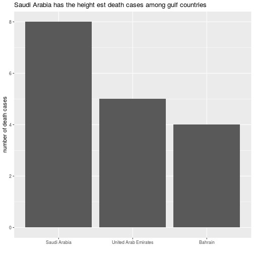
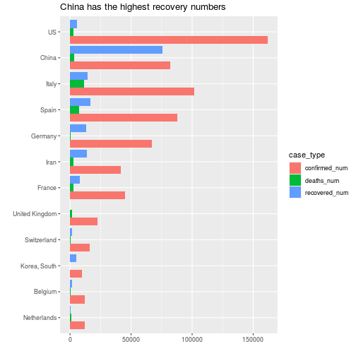
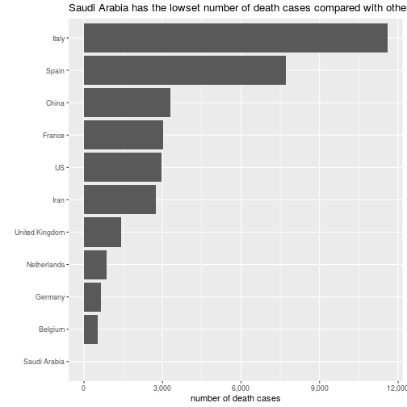
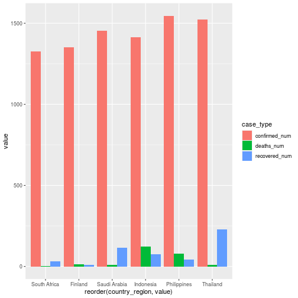
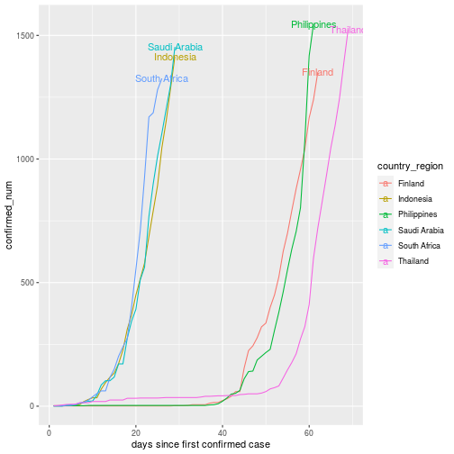
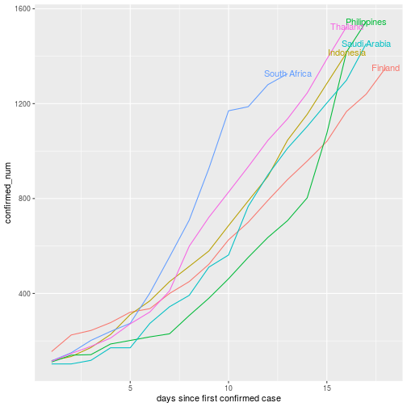

## Calling libs


```r
library(tidyverse)
library(tidylog)
library(plotly)
```


## Reading data

```r
d <- read_csv("data/processed.csv")
```


## Gulf countries


```r
g_countries <- c("Saudi Arabia", "United Arab Emirates", "Bahrain")

d_gulf <- 
  d %>% 
  filter(country_region %in% g_countries,
         date == max(date))
```

Saudi Arabia has the highest number of death cases but the number is reasonable given the number of people living in the kingdom. 


```r
 d_gulf %>% 
  ggplot(aes(x = reorder(country_region, -deaths_num), y = deaths_num))+
  geom_col()+
  labs(
    x = "",
    y = "number of death cases",
    title = "Saudi Arabia has the height est death cases among gulf countries"
  )
```



## Highest confirmed and deaths countries

China has the highest recovered cases. 

```r
highest_confirmed_countries <- 
  d %>% 
  filter(date == max(date)) %>% 
  pivot_longer(-c(date, country_region), names_to = "case_type") %>% 
  filter(case_type == "confirmed_num") %>% 
  arrange(desc(value)) %>% 
  head(10) %>% 
  pull(country_region)

highest_deaths_countries <- 
   d %>% 
  filter(date == max(date)) %>% 
  pivot_longer(-c(date, country_region), names_to = "case_type") %>% 
  filter(case_type == "deaths_num") %>% 
  arrange(desc(value)) %>% 
  head(10) %>% 
  pull(country_region)


highest_recovered_countries <- 
   d %>% 
  filter(date == max(date)) %>% 
  pivot_longer(-c(date, country_region), names_to = "case_type") %>% 
  filter(case_type == "recovered_num") %>% 
  arrange(desc(value)) %>% 
  head(10) %>% 
  pull(country_region)
  
d_top_countries <- 
  c(highest_recovered_countries, highest_deaths_countries, highest_recovered_countries) %>% 
  unique()
```


```r
d %>% 
  filter(
    date == max(date), 
    country_region %in% d_top_countries
    ) %>% 
 pivot_longer(-c(date, country_region), names_to = "case_type") %>% 
  ggplot(aes(x = reorder(country_region, value), y = value, fill= case_type))+
  geom_col(position = "dodge")+
  coord_flip()+
  labs(
    x = "",
    y = "",
    title = "China has the highest recovery numbers"
  )
```



## number of deaths in Saudi Arabia compared to top 10 % countries


```r
deaths_top_countreis <- 
  d %>% 
  filter(
    date == max(date),
    ) %>% 
  select(-confirmed_num, - recovered_num) %>% 
  arrange(desc(deaths_num)) %>% 
  head(10)

saudi <-
   d %>% 
  filter(
    date == max(date),
    country_region == "Saudi Arabia"
    ) %>% 
  select(-confirmed_num, -recovered_num)


deaths_top_countreis <-
  deaths_top_countreis %>% 
  rbind(saudi)


deaths_top_countreis %>% 
  ggplot(aes(x = reorder(country_region, deaths_num), y = deaths_num))+
  geom_col()+
  coord_flip()+
  scale_y_continuous(labels = scales::comma)+
  labs(
    y = "number of death cases",
    x = "",
    title = "Saudi Arabia has the lowset number of death cases compared with other countries"
  )
```




## comparing Saudi Arabia to countries have the same range of number of deaths

Saudi Arabia has the second highest number of recovered cases. 

```r
d %>% 
  filter(
    date == max(date),
    confirmed_num < 1650 & confirmed_num > 1300
    ) %>% 
  arrange(desc(confirmed_num)) %>% 
  pivot_longer(-c(date, country_region), names_to = "case_type") %>% 
  ggplot(aes(x = reorder(country_region, value), y = value, fill = case_type))+
  geom_col(position = "dodge")
```




```r
similar_countries <- 
  d %>% 
  filter(
    date == max(date),
    confirmed_num < 1650 & confirmed_num > 1300
    ) %>% 
  pull(country_region)
```


```r
d %>% 
  filter(country_region %in% similar_countries) %>% 
  ggplot(aes(x = date, y = confirmed_num, col= country_region))+
  geom_line()
```


```r
ggplotly()
```

```
## Error in loadNamespace(name): there is no package called 'webshot'
```


```r
d %>% count(country_region)
```

```
## # A tibble: 178 x 2
##    country_region          n
##    <chr>               <int>
##  1 Afghanistan            69
##  2 Albania                69
##  3 Algeria                69
##  4 Andorra                69
##  5 Angola                 69
##  6 Antigua and Barbuda    69
##  7 Argentina              69
##  8 Armenia                69
##  9 Australia              69
## 10 Austria                69
## # … with 168 more rows
```

```r
d_similar <- 
d %>% 
  filter(confirmed_num > 0) %>% 
  arrange(date) %>% 
  group_by(country_region) %>% 
  mutate(day_num = 1:n()) %>% 
  filter(country_region %in% similar_countries) 

d_similar %>% 
  ggplot(aes(x = day_num, y = confirmed_num, col= country_region))+
  geom_line()+
  geom_text(data = d_similar %>% filter(date == max(date)), aes(label = country_region))+
  labs(
    x = "days since first confirmed case"
  )
```




```r
d_similar_100 <- 
  d %>% 
  filter(confirmed_num >= 100) %>% 
  arrange(date) %>% 
  group_by(country_region) %>% 
  mutate(day_num = 1:n()) %>% 
  filter(country_region %in% similar_countries)   


d_similar_100 %>% 
  ggplot(aes(x = day_num, y = confirmed_num, col= country_region))+
  geom_line()+
  geom_text(data = d_similar_100 %>% filter(date == max(date)), aes(label = country_region))+
  labs(
    x = "days since first confirmed case"
  )+
  theme(
    legend.position = "none"
  )
```




```r
d_all_100 <- 
  d %>% 
  filter(confirmed_num >= 100) %>% 
  arrange(date) %>% 
  group_by(country_region) %>% 
  mutate(day_num = 1:n())    


d_all_100 %>% 
  ggplot(aes(x = day_num, y = confirmed_num, col= country_region))+
  geom_line()+
  geom_text(data = d_all_100 %>% filter(date == max(date)), aes(label = country_region))+
  labs(
    x = "days since first confirmed case"
  )+
  theme(
    legend.position = "none"
  )
```


```r
d_all_1400 <- 
  d %>% 
  filter(confirmed_num >= 1400) %>% 
  arrange(date) %>% 
  group_by(country_region) %>% 
  mutate(day_num = 1:n())    


d_all_1400 %>% 
  ggplot(aes(x = day_num, y = confirmed_num, col= country_region))+
  geom_line()+
  geom_text(data = d_all_1400 %>% filter(date == max(date)), aes(label = country_region))+
  labs(
    x = "days since first confirmed case"
  )+
  theme(
    legend.position = "none"
  )
```


